# Inventaris Web (Laravel 11)

Aplikasi **Inventaris Barang** berbasis web yang dibangun menggunakan framework **Laravel 11** dan database **MySQL**. Sistem ini dirancang untuk memudahkan pengelolaan data barang, kategori, serta sirkulasi peminjaman alat di lingkungan laboratorium/sekolah.

## Fitur Unggulan
- **Multi-User Role**: Admin (Pengelola) & User (Peminjam).
- **Dashboard Statistik**: Ringkasan data real-time.
- **Manajemen Inventaris**: CRUD Barang & Kategori dengan gambar.
- **Sirkulasi Peminjaman**: Pengajuan, persetujuan admin, dan pengembalian.
- **Katalog Online**: Pencarian dan filter barang yang mudah.

## Teknologi
- **Backend**: Laravel 11 (PHP 8.2+)
- **Frontend**: Blade Templates + Tailwind CSS
- **Database**: MySQL

## Instalasi

1. **Clone/Extract Project**
   Pastikan folder berada di root web server atau folder kerja Anda.

2. **Install Dependencies**
   ```bash
   composer install
   npm install && npm run build
   ```

3. **Setup Database**
   - Buat database `db_inventaris` di MySQL.
   - Copy `.env.example` ke `.env`.
   - Update config DB di `.env`:
     ```env
     DB_DATABASE=db_inventaris
     DB_USERNAME=root
     DB_PASSWORD=
     ```

4. **Migrasi & Seed**
   ```bash
   php artisan key:generate
   php artisan migrate:fresh --seed
   ```

5. **Jalankan Aplikasi**
   ```bash
   php artisan serve
   ```
   Akses di: `http://localhost:8000`

---

## Galeri Antarmuka

Berikut adalah tampilan antarmuka aplikasi:

### Halaman Login & Dashboard
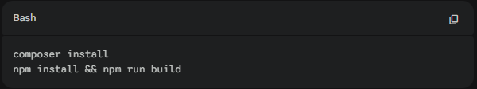
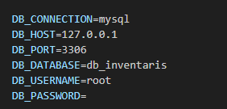

### Manajemen Data (Barang & Kategori)
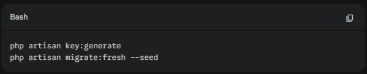
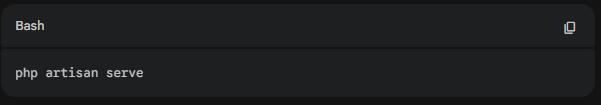
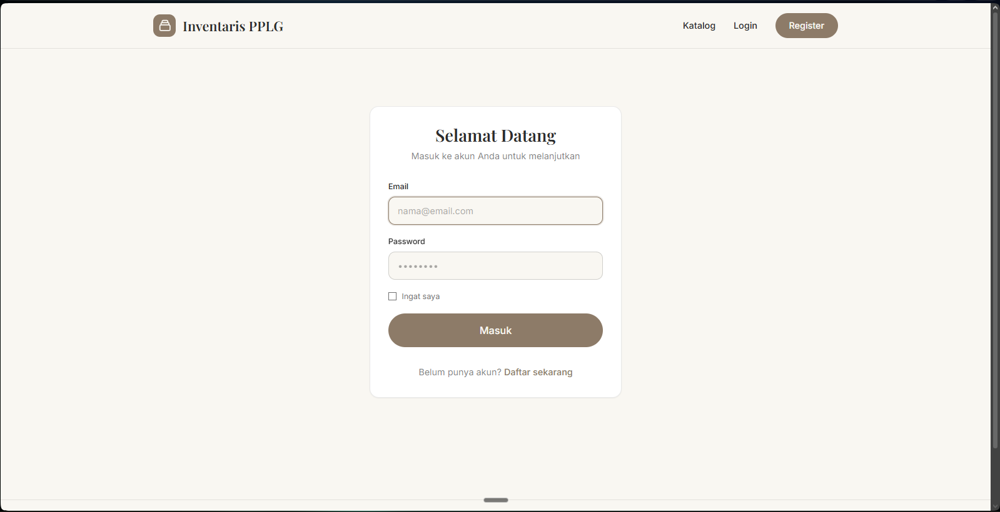

### Peminjaman & Katalog User
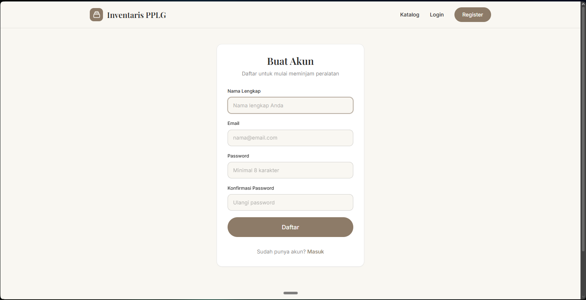
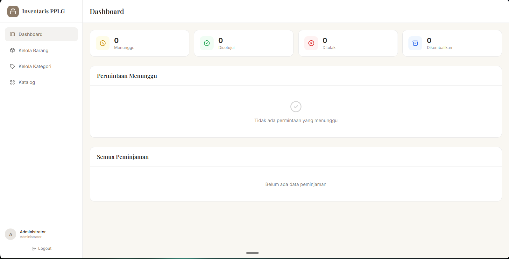
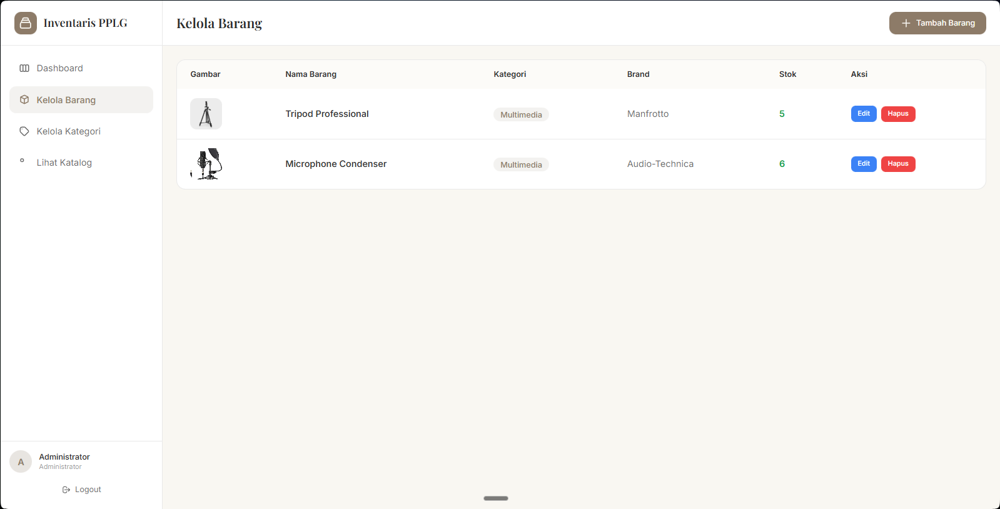
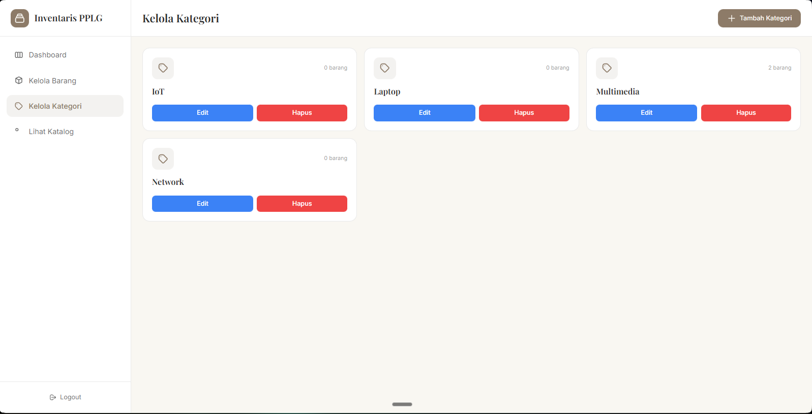

### Fitur Lainnya
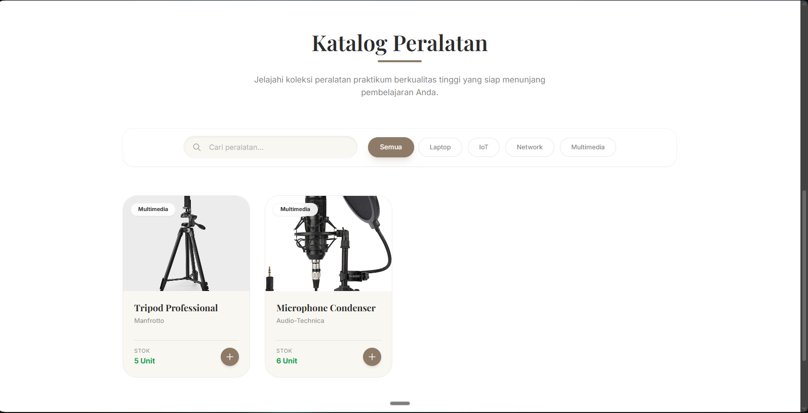
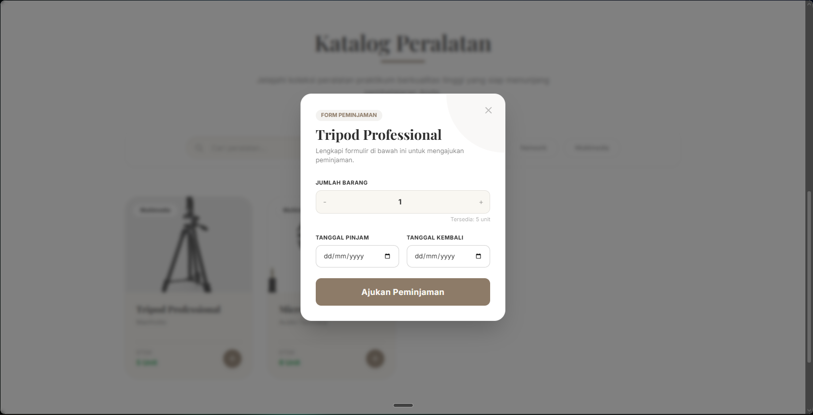
